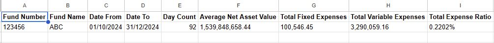
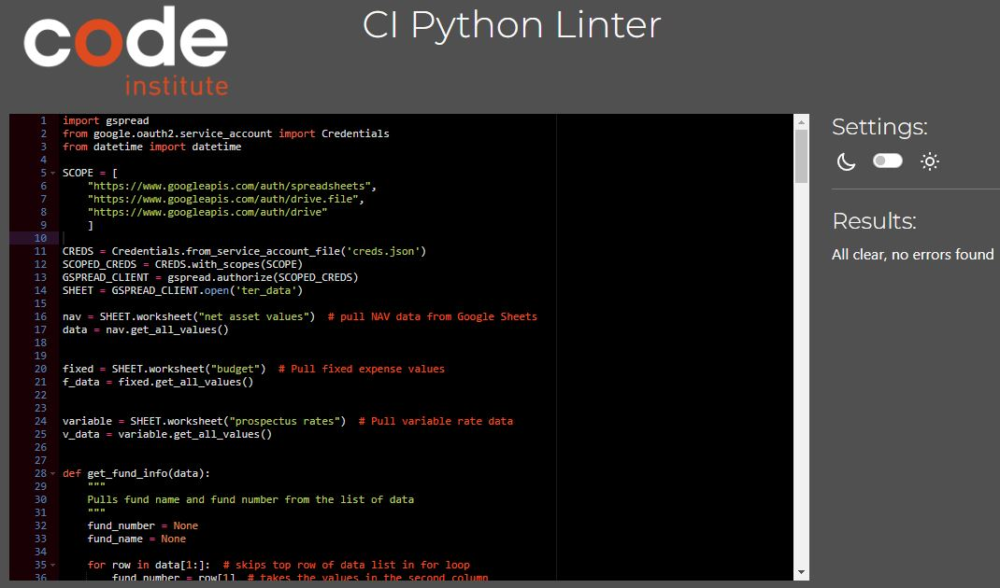

# TER-ribly Financial TER Program

Welcome,

TER-ribly Financial is a Python terminal prgram, which runs in the Code Institute mock terminal on Heroku.

The live version was deployed to Heroku via GitHub and can be found here:

[TER-ribly Financial](https://ter-ribly-financial-ebc03ebd637e.herokuapp.com/)

## How To Run

Users must select a date range within 2024 and a TER is calculated for that date range based on the following data:
<ul>
    <li>Average NAV
    <li>Fixed Expenses
    <li>Variable Expenses
    <li>Total Expenses
    <li>Day Count
</ul>

## Features

#### Input validation and error checking
<ul>
    <li>Dates must be in dd/mm/yyyy format
    <li>From Date cannot be greater than To Date
    <li>Dates selected must be within the data set provided (2024)
</ul>

#### Fixed expenses calculation based on budget data provided

#### Variable expenses calculation based on the prospectus rates provided

#### Day count based on user date selection

#### Worksheet updates

#### Run History

## Data Model
The data model reflects the structure of the Total Expense Ratio (TER) calculations, detailing the basic fund info,
time period, average NAV, expenses and the calculated TER.  The model uses and stores the data within the worksheets.

#### Data calculated in Terminal

#### Calculated data pushed to TER worksheet

#### History of calculated data stored in run history worksheet

## Testing

### Bugs
Squashed bugs were:
<ul>
    <li>Datetime format - Converting data from string to date, and in dd/mm/yyyy, proved tough to begin with,
        but this was corrected after reviewing the course materials and the Python.org materials
    <li>Variable Expenses - The calculation was incorrect at the beginning due to the incorrect use of parentheses. 
        The final formula is total_variable += (average_nav * rate * day_count) / (len(data)-1)
    <li>
    <li>
    <li>
</ul>

### Remaining Bugs
No bugs remain

### Validator Testing
No errors were returned from the Code Institute's Python Linter [PEP8](https://pep8ci.herokuapp.com/)

## Deployment
The project was deployed using Code Institute's mock terminal for Heroku.

Steps for deployment were:
<ul>
    <li>Create a new Heroku app
    <li>Set the buildbacks to Python and NodeJS in that order
    <li>Additional step of adding PORT 8000 was implemented as per CI guidelines
    <li>Link the Heroku app to the repository
    <li>Click on Deploy
</ul>

## Credits

Code Institute - Python Essentials

[Code Institute - Love Sandwiches - Essentials Project](https://github.com/Code-Institute-Solutions/love-sandwiches-p5-sourcecode/tree/master/05-deployment/01-deployment-part-1)

[Stack Overflow - General Queries](https://stackoverflow.com/)

[Python.org - Datetime](https://docs.python.org/3/library/datetime.html)

[Python.org - Math](https://docs.python.org/3/library/math.html)
